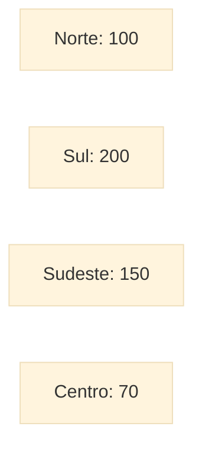
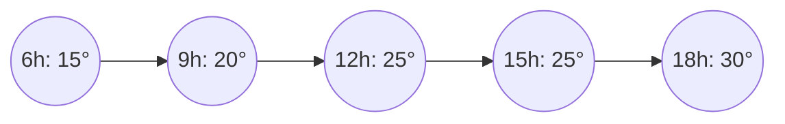
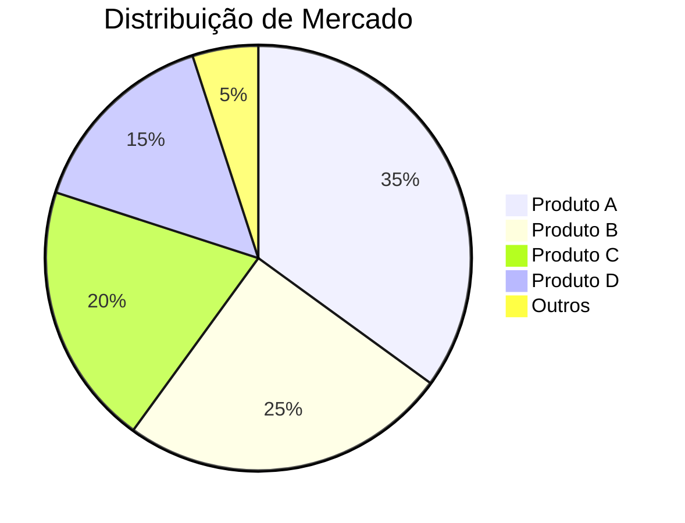
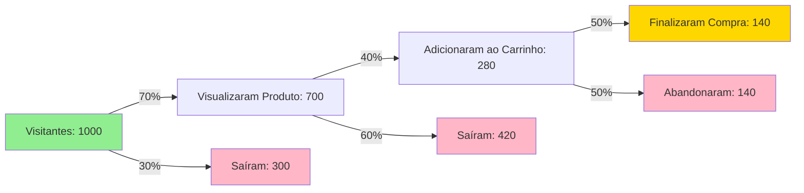
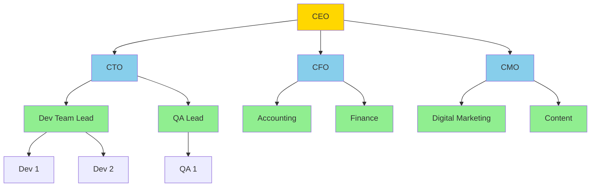

# 📊 Guia Visual de Tipos de Gráficos

Um guia completo dos tipos mais comuns e sofisticados de gráficos para visualização de dados.

---

## 📑 Índice

- [Gráficos Básicos](#gráficos-básicos)
- [Gráficos Intermediários](#gráficos-intermediários)
- [Gráficos Sofisticados](#gráficos-sofisticados)

---

## 🟢 Gráficos Básicos

### 1. Gráfico de Barras (Bar Chart)

**Descrição**: Compara valores entre categorias usando barras retangulares.

**Quando usar**:
- Comparar quantidades entre diferentes categorias
- Mostrar rankings ou classificações
- Dados categóricos com valores numéricos

**Exemplo Visual**:
```
Vendas por Região

Sul     ████████████████████ 200
Sudeste ███████████████ 150
Norte   ██████████ 100
Centro  ███████ 70
```



---

### 2. Gráfico de Linhas (Line Chart)

**Descrição**: Mostra tendências ao longo do tempo conectando pontos de dados.

**Quando usar**:
- Visualizar tendências temporais
- Mostrar mudanças contínuas
- Comparar múltiplas séries temporais

**Exemplo Visual**:
```
Temperatura ao Longo do Dia

30°C ─                    ●
25°C ─          ●───●───●─┘
20°C ─    ●───●─┘
15°C ─●───┘
     ─┴───┴───┴───┴───┴───
     6h  9h  12h 15h 18h
```



---

### 3. Gráfico de Pizza (Pie Chart)

**Descrição**: Mostra proporções de um todo em fatias circulares.

**Quando usar**:
- Mostrar partes de um todo (100%)
- Máximo de 5-7 categorias
- Quando as proporções são importantes

**Exemplo Visual**:



**ASCII Representation**:
```
        Outros 5%
    Produto D 15%  ╱─────╲  Produto A 35%
                  │   ●   │
    Produto C 20% ╲─────╱  Produto B 25%
```

---

### 4. Gráfico de Dispersão (Scatter Plot)

**Descrição**: Mostra a relação entre duas variáveis usando pontos.

**Quando usar**:
- Identificar correlações entre variáveis
- Detectar outliers
- Visualizar distribuição de dados

**Exemplo Visual**:
```
Altura vs Peso

200kg─              ●
     │           ●     ●
150kg─        ●   ● ●
     │      ●  ●●
100kg─   ● ●●
     │  ●●
 50kg─ ●
     └─┴───┴───┴───┴───
      150 160 170 180 190cm
```

---

## 🟡 Gráficos Intermediários

### 5. Histograma (Histogram)

**Descrição**: Mostra a distribuição de frequência de dados contínuos.

**Quando usar**:
- Visualizar distribuição de dados
- Identificar padrões de frequência
- Verificar normalidade dos dados

**Exemplo Visual**:
```
Distribuição de Idades

Freq
 15│        ████
 10│    ████████████
  5│████████████████████
  0└─┴──┴──┴──┴──┴──┴──
    0-10 10-20 20-30 30-40 40-50
           Idade (anos)
```

---

### 6. Box Plot (Caixa e Bigode)

**Descrição**: Mostra a distribuição de dados através de quartis.

**Quando usar**:
- Comparar distribuições entre grupos
- Identificar outliers
- Visualizar mediana e quartis

**Exemplo Visual**:
```
Salários por Departamento

TI        ─●──┤   ├──●─     ○
Vendas    ──●─┤   ├───────●
RH        ─●──┤ ├─●
          │   │   │   │
        Min  Q1 Med Q3  Max  Outlier

Legenda:
● = Mínimo/Máximo normal
┤ ├ = Q1 e Q3
│ = Mediana
○ = Outlier
```

---

### 7. Mapa de Calor (Heatmap)

**Descrição**: Usa cores para representar valores em uma matriz.

**Quando usar**:
- Mostrar padrões em dados matriciais
- Visualizar correlações
- Mostrar intensidade em duas dimensões

**Exemplo Visual**:
```
Vendas por Mês e Região

       │ Jan │ Fev │ Mar │ Abr │
───────┼─────┼─────┼─────┼─────┤
Norte  │ ░░░ │ ▒▒▒ │ ▓▓▓ │ ███ │
Sul    │ ▓▓▓ │ ███ │ ███ │ ▓▓▓ │
Leste  │ ▒▒▒ │ ▒▒▒ │ ░░░ │ ▒▒▒ │
Oeste  │ ░░░ │ ░░░ │ ▒▒▒ │ ▓▓▓ │

Legenda: ░░░ Baixo  ▒▒▒ Médio  ▓▓▓ Alto  ███ Muito Alto
```

---

### 8. Gráfico de Área Empilhada (Stacked Area Chart)

**Descrição**: Mostra múltiplas séries temporais empilhadas.

**Quando usar**:
- Mostrar composição ao longo do tempo
- Comparar contribuições de cada parte
- Visualizar tendências cumulativas

**Exemplo Visual**:
```
Receita por Produto (Empilhado)

$500k─                    ▓▓▓▓
     │              ▒▒▒▒▒▒▓▓▓▓
$400k─        ░░░░░░▒▒▒▒▒▒▓▓▓▓  ← Produto C
     │  ░░░░░░▒▒▒▒▒▒▓▓▓▓▓▓▓▓▓▓
$300k─░░▒▒▒▒▒▒▓▓▓▓▓▓▓▓▓▓▓▓▓▓▓▓  ← Produto B
     │▒▒▒▒▒▒▒▒▓▓▓▓▓▓▓▓▓▓▓▓▓▓▓▓
$200k─▓▓▓▓▓▓▓▓▓▓▓▓▓▓▓▓▓▓▓▓▓▓▓▓  ← Produto A
     └─┴───┴───┴───┴───┴───┴──
      Q1  Q2  Q3  Q4  Q1  Q2
```

---

## 🔴 Gráficos Sofisticados

### 9. Diagrama de Sankey

**Descrição**: Mostra fluxos e suas proporções entre nós.

**Quando usar**:
- Visualizar fluxos de energia, dinheiro ou recursos
- Mostrar transições entre estados
- Representar conversões em funis

**Exemplo Visual**:



---

### 10. Treemap

**Descrição**: Representa hierarquias usando retângulos aninhados proporcionais.

**Quando usar**:
- Mostrar proporções hierárquicas
- Visualizar uso de espaço ou recursos
- Comparar tamanhos relativos de categorias

**Exemplo Visual**:
```
Orçamento da Empresa ($1M Total)

┌─────────────────────────────────────────────┐
│ Tecnologia $500k                             │
│ ┌──────────────┐ ┌────────┐ ┌──────────┐   │
│ │ Infraestrutura│ │Pessoal │ │Licenças  │   │
│ │ $300k        │ │$150k   │ │$50k      │   │
│ └──────────────┘ └────────┘ └──────────┘   │
├─────────────────────────────────────────────┤
│ Marketing $300k          │ RH $200k         │
│ ┌──────┐ ┌──────┐       │ ┌────┐ ┌────┐   │
│ │Digital│ │Trad. │       │ │Rec.│ │Ben.│   │
│ │$200k │ │$100k │       │ │$100│ │$100│   │
│ └──────┘ └──────┘       │ └────┘ └────┘   │
└──────────────────────────┴──────────────────┘
```

---

### 11. Sunburst (Gráfico de Raios de Sol)

**Descrição**: Representa hierarquias em círculos concêntricos.

**Quando usar**:
- Visualizar estruturas hierárquicas multiníveis
- Mostrar drill-down de categorias
- Representar proporções em árvores

**Exemplo Visual**:
```
        Estrutura de Vendas ($1M)

              ┌──E-com $200k──┐
         ┌────┤               ├────┐
    ┌───┤    └───────────────┘    ├───┐
    │   │                          │   │
   ┌┘   └┐  Vendas Online $400k  ┌┘   └┐
   │App  │        ╱─────╲         │Site │
   │$200k│       │   ●   │        │$200k│
   └┐   ┌┘       ╲─────╱         └┐   ┌┘
    │   │                          │   │
    └───┤    ┌───────────────┐    ├───┘
         └────┤ Lojas Físicas ├────┘
              └───$600k───────┘
```

---

### 12. Violin Plot

**Descrição**: Combina box plot com densidade de distribuição.

**Quando usar**:
- Mostrar distribuição completa dos dados
- Comparar distribuições entre grupos
- Identificar multimodalidade

**Exemplo Visual**:
```
Distribuição de Salários por Nível

Júnior    ╱│╲        Pleno      ╱───│───╲    Sênior    ╱──────│──────╲
         ╱ │ ╲               ╱    │    ╲             ╱       │       ╲
        │  ├─ │             │     ├─    │           │        ├─       │
        │  │  │             │     │     │           │        │        │
         ╲ │ ╱               ╲    │    ╱             ╲       │       ╱
          ╲│╱                 ╲───│───╱               ╲──────│──────╱
          │                       │                           │
        $30k                    $60k                       $120k
```

---

### 13. Parallel Coordinates (Coordenadas Paralelas)

**Descrição**: Mostra dados multidimensionais em eixos paralelos.

**Quando usar**:
- Visualizar dados com múltiplas dimensões
- Identificar padrões e correlações complexas
- Comparar perfis multivariados

**Exemplo Visual**:
```
Análise de Performance de Produtos

Preço    Qualidade  Vendas   Satisfação
$$$  │      ★★★  │   1000   │     95%
 $$  │      ★★   │    500   │     80%
  $  │      ★    │    100   │     60%
─────┼───────────┼──────────┼─────────
 │   │     ╱     │    ╱│    │   ╱
 │   │   ╱       │  ╱  │    │ ╱
 │   │ ╱         │╱    │    │╱      ← Produto A
 │   ╱           ╱     │   ╱│
 │ ╱           ╱       │ ╱  │       ← Produto B
 ╱           ╱         ╱    │
                            │       ← Produto C
```

---

### 14. Waterfall Chart (Gráfico de Cascata)

**Descrição**: Mostra como valores sequenciais contribuem para um total.

**Quando usar**:
- Análise de variação financeira
- Mostrar contribuições positivas e negativas
- Explicar mudanças cumulativas

**Exemplo Visual**:
```
Análise de Lucro Mensal

$150k ────────────────────── ▓▓▓  Lucro Final
                        ▓▓▓▓▓
$120k              ░░░░░
                ░░░░
$100k  ████
       ████   ▒▒▒▒
 $80k  ████   ▒▒▒▒  ███
       ████   ▒▒▒▒  ███
 $60k  ████   ▒▒▒▒  ███
       ████   ▒▒▒▒  ███
 $40k  ████   ▒▒▒▒  ███
       ████   ▒▒▒▒  ███
       ────   ────  ────  ────
     Receita Custos Taxas Lucro
     Inicial        -30k   -20k
     +100k

Legenda: ████ Inicial  ▒▒▒▒ Redução  ░░░░ Acréscimo  ▓▓▓ Final
```

---

### 15. Network Graph (Grafo de Rede)

**Descrição**: Mostra relacionamentos e conexões entre entidades.

**Quando usar**:
- Visualizar redes sociais
- Mostrar dependências entre componentes
- Mapear relacionamentos organizacionais

**Exemplo Visual**:



**ASCII Representation**:
```
         CEO
        ╱ │ ╲
       ╱  │  ╲
     CTO CFO CMO
     ╱╲   │   ╱╲
    ╱  ╲  │  ╱  ╲
  Dev  QA │ Mkt Content
```

---

### 16. Radar Chart (Gráfico de Radar)

**Descrição**: Compara múltiplas variáveis em formato radial.

**Quando usar**:
- Comparar perfis multivariados
- Avaliar competências ou características
- Análise de performance em múltiplas dimensões

**Exemplo Visual**:
```
Análise de Competências

        Comunicação
              ●
              │╲
         ╱────┤─●────╲
    Liderança │  ╲    Técnica
         ●────┤───●
         │    │    │
         │    ●    │  Criatividade
         │    │    │
         ●────┼────●
    Trabalho  │   Resolução
    em Equipe │   Problemas
              ●

Legenda: ● Pontos fortes (80-100%)
         Interior: Área de desenvolvimento
```

---

### 17. Bullet Chart

**Descrição**: Compara valor atual com meta e faixas de referência.

**Quando usar**:
- Dashboards de KPIs
- Comparar performance com metas
- Mostrar faixas de qualidade

**Exemplo Visual**:
```
Performance de Vendas Q1

Meta: $500k
Atual: $450k

Ruim     │ Médio    │ Bom      │ Excelente
░░░░░░░░░│▒▒▒▒▒▒▒▒▒▒│▓▓▓▓▓▓▓▓▓▓│██████████
         │          │██████────│     │
         │          │    ▲     │     ▼
       $200k      $350k  │   $500k  $600k
                       Atual   Meta
```

---

### 18. Chord Diagram

**Descrição**: Mostra relações e fluxos entre entidades em círculo.

**Quando usar**:
- Visualizar fluxos migratórios
- Mostrar relacionamentos de comércio
- Representar transferências entre grupos

**Exemplo Visual**:
```
Fluxo de Dados entre Sistemas

            Sistema A
               ●
              ╱ ╲
            ╱     ╲
          ╱         ╲
        ●             ●
   Sistema D     Sistema B
        │             │
         ╲           ╱
          ╲         ╱
           ╲       ╱
            ╲     ╱
               ●
          Sistema C

Espessura das linhas = Volume de dados
A→B: Alto | A→C: Médio | B→D: Baixo
```

---

## 🎯 Guia de Seleção Rápida

### Por Tipo de Dados

| Tipo de Dado | Gráficos Recomendados |
|--------------|----------------------|
| Temporal | Linha, Área Empilhada |
| Categórico | Barras, Pizza (≤7 categorias) |
| Distribuição | Histograma, Box Plot, Violin |
| Relação | Dispersão, Parallel Coordinates |
| Hierárquico | Treemap, Sunburst, Network |
| Fluxo | Sankey, Chord, Waterfall |
| Comparação | Barras, Bullet, Radar |
| Geográfico | Mapas de Calor, Choropleth |

### Por Objetivo

| Objetivo | Gráfico Ideal |
|----------|---------------|
| Mostrar tendência temporal | **Linha** |
| Comparar categorias | **Barras** |
| Mostrar proporções | **Pizza** ou **Treemap** |
| Identificar outliers | **Box Plot** |
| Visualizar correlação | **Dispersão** |
| Mostrar distribuição | **Histograma** ou **Violin** |
| Representar fluxos | **Sankey** |
| Comparar múltiplas dimensões | **Radar** ou **Parallel** |
| Mostrar hierarquia | **Sunburst** ou **Treemap** |
| Analisar performance vs meta | **Bullet** |

---

## 📚 Recursos Adicionais

### Bibliotecas para Criar Gráficos

**Python:**
- Matplotlib (básico)
- Seaborn (estatístico)
- Plotly (interativo)
- Altair (declarativo)
- Bokeh (web)

**JavaScript:**
- D3.js (customizado)
- Chart.js (simples)
- Plotly.js (científico)
- Highcharts (completo)
- ECharts (rico em features)

**R:**
- ggplot2 (elegante)
- plotly (interativo)
- lattice (multivariado)

### Princípios de Boa Visualização

1. ✅ **Escolha o gráfico certo para seus dados**
2. ✅ **Mantenha simples - evite 3D desnecessário**
3. ✅ **Use cores intencionalmente**
4. ✅ **Adicione contexto com títulos e legendas**
5. ✅ **Considere seu público**
6. ✅ **Teste acessibilidade (daltonismo)**
7. ✅ **Remova elementos desnecessários (chartjunk)**

---

## 📊 Caracteres Úteis para Visualizações ASCII

```
Blocos: █ ▓ ▒ ░ ▀ ▄ ▌ ▐
Formas: ● ○ ◆ ◇ ■ □ ▲ △ ▼ ▽
Linhas: ─ │ ┌ ┐ └ ┘ ├ ┤ ┬ ┴ ┼
Setas: → ← ↑ ↓ ↗ ↘ ↙ ↖ ⇒ ⇐ ⇑ ⇓
Matemática: ± × ÷ ≈ ≠ ≤ ≥ ∑ ∫ √
Especiais: ★ ☆ ♠ ♣ ♥ ♦ ☺ ☻
```

---

**Criado em**: 2026-01-22
**Versão**: 1.0
**Formato**: Markdown com Mermaid diagrams

---

💡 **Dica Final**: A melhor visualização é aquela que comunica sua mensagem de forma clara e precisa para seu público específico!
